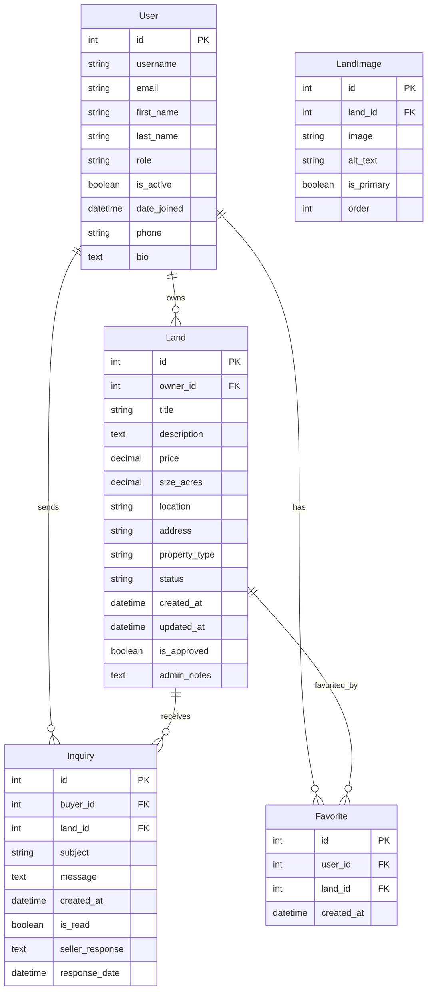

# Design Document

## Overview

LandHub is a Django-based land-only real estate platform featuring role-based dashboards for Admin, Seller, and Buyer users. The system leverages modern frontend technologies including Tailwind CSS, HTMX, Unpoly, Alpine.js, and ShadCN UI components to deliver a responsive, interactive user experience. The architecture follows Django's MVT pattern with enhanced frontend interactivity through progressive enhancement.

## Architecture

### Backend Architecture

```
LandHub/
├── LandHub/                 # Django project settings
│   ├── settings.py         # Enhanced with media, static, templates config
│   ├── urls.py            # Main URL routing
│   └── wsgi.py            # WSGI application
├── landmarket/            # Main Django app
│   ├── models.py          # User, Land, Inquiry models
│   ├── views.py           # Role-based dashboard views
│   ├── urls.py            # App-specific routing
│   ├── admin.py           # Django admin customization
│   ├── forms.py           # Django forms with validation
│   └── templatetags/      # Custom template tags
├── templates/             # Global templates
│   ├── base.html          # Base template with CDN includes
│   ├── components/        # Reusable UI components
│   ├── dashboards/        # Role-specific dashboard templates
│   └── auth/              # Authentication templates
├── static/                # Static assets
│   ├── css/              # Custom CSS (minimal, Tailwind-first)
│   ├── js/               # Alpine.js components and custom JS
│   └── images/           # Static images
└── media/                # User-uploaded content
    └── listings/         # Land listing photos
```

### Frontend Technology Stack

- **Tailwind CSS (CDN)**: Utility-first CSS framework for responsive design
- **HTMX**: Dynamic HTML updates without JavaScript frameworks
- **Unpoly**: Progressive enhancement for seamless page transitions
- **Alpine.js**: Lightweight JavaScript framework for interactive components
- **ShadCN UI**: Pre-built UI components adapted for Django templates

### Database Schema



## Components and Interfaces

### 1. User Authentication & Role Management

**Extended User Model**
- Extends Django's built-in User model with custom fields
- Role-based permissions (Admin, Seller, Buyer)
- Profile information and contact details

**Authentication Views**
- Login/Logout with role-based redirects
- Registration with email verification
- Password reset functionality
- Profile management

### 2. Dashboard Components

**Base Dashboard Template**
```html
<!-- Responsive sidebar with Alpine.js mobile toggle -->
<div x-data="{ sidebarOpen: false }" class="flex h-screen bg-gray-100">
    <!-- Sidebar component with role-based navigation -->
    <!-- Main content area with HTMX dynamic loading -->
</div>
```

**Admin Dashboard**
- User management interface with search/filter
- Listing approval queue with batch actions
- Analytics dashboard with charts
- System settings and configuration

**Seller Dashboard**
- Listing management with status indicators
- Photo upload with drag-and-drop interface
- Inquiry management and response system
- Performance analytics for listings

**Buyer Dashboard**
- Property search with advanced filters
- Favorites management
- Inquiry history and tracking
- Saved searches functionality

### 3. Land Listing System

**Listing Model & Views**
- Comprehensive property information storage
- Multiple image support with primary image designation
- Status workflow (Draft → Pending → Approved/Rejected)
- Location-based search capabilities

**Listing Components**
- Card-based listing display with responsive grid
- Detailed listing view with image gallery
- Filter sidebar with HTMX dynamic updates
- Map integration for location visualization

### 4. Inquiry System

**Inquiry Management**
- Buyer-to-seller communication system
- Email notifications for new inquiries
- Response tracking and history
- Inquiry status management

## Data Models

### User Model Extension
```python
class UserProfile(models.Model):
    user = models.OneToOneField(User, on_delete=models.CASCADE)
    ROLE_CHOICES = [
        ('admin', 'Administrator'),
        ('seller', 'Seller'),
        ('buyer', 'Buyer'),
    ]
    role = models.CharField(max_length=10, choices=ROLE_CHOICES)
    phone = models.CharField(max_length=15, blank=True)
    bio = models.TextField(blank=True)
    avatar = models.ImageField(upload_to='avatars/', blank=True)
    created_at = models.DateTimeField(auto_now_add=True)
```

### Land Model
```python
class Land(models.Model):
    owner = models.ForeignKey(User, on_delete=models.CASCADE)
    title = models.CharField(max_length=200)
    description = models.TextField()
    price = models.DecimalField(max_digits=12, decimal_places=2)
    size_acres = models.DecimalField(max_digits=10, decimal_places=2)
    location = models.CharField(max_length=200)
    address = models.TextField()
    
    PROPERTY_TYPES = [
        ('residential', 'Residential'),
        ('commercial', 'Commercial'),
        ('agricultural', 'Agricultural'),
        ('recreational', 'Recreational'),
    ]
    property_type = models.CharField(max_length=20, choices=PROPERTY_TYPES)
    
    STATUS_CHOICES = [
        ('draft', 'Draft'),
        ('pending', 'Pending Approval'),
        ('approved', 'Approved'),
        ('rejected', 'Rejected'),
        ('sold', 'Sold'),
    ]
    status = models.CharField(max_length=20, choices=STATUS_CHOICES, default='draft')
    is_approved = models.BooleanField(default=False)
    admin_notes = models.TextField(blank=True)
    
    created_at = models.DateTimeField(auto_now_add=True)
    updated_at = models.DateTimeField(auto_now=True)
```

### Supporting Models
```python
class LandImage(models.Model):
    land = models.ForeignKey(Land, related_name='images', on_delete=models.CASCADE)
    image = models.ImageField(upload_to='listings/')
    alt_text = models.CharField(max_length=200, blank=True)
    is_primary = models.BooleanField(default=False)
    order = models.PositiveIntegerField(default=0)

class Inquiry(models.Model):
    buyer = models.ForeignKey(User, on_delete=models.CASCADE)
    land = models.ForeignKey(Land, on_delete=models.CASCADE)
    subject = models.CharField(max_length=200)
    message = models.TextField()
    created_at = models.DateTimeField(auto_now_add=True)
    is_read = models.BooleanField(default=False)
    seller_response = models.TextField(blank=True)
    response_date = models.DateTimeField(null=True, blank=True)

class Favorite(models.Model):
    user = models.ForeignKey(User, on_delete=models.CASCADE)
    land = models.ForeignKey(Land, on_delete=models.CASCADE)
    created_at = models.DateTimeField(auto_now_add=True)
    
    class Meta:
        unique_together = ('user', 'land')
```

## Error Handling

### Frontend Error Handling
- HTMX error responses with user-friendly messages
- Form validation with real-time feedback
- Network error handling with retry mechanisms
- Progressive enhancement fallbacks

### Backend Error Handling
- Custom error pages (404, 500) with consistent styling
- Form validation with Django's built-in validators
- File upload validation (size, type, security)
- Database constraint error handling

### Security Measures
- CSRF protection for all forms
- File upload security validation
- SQL injection prevention through ORM
- XSS protection through template escaping
- Role-based access control decorators

## Testing Strategy

### Backend Testing
- Unit tests for models, views, and forms
- Integration tests for user workflows
- API endpoint testing for HTMX responses
- Database migration testing

### Frontend Testing
- Component testing for Alpine.js interactions
- HTMX request/response testing
- Responsive design testing across devices
- Accessibility testing for screen readers

### User Acceptance Testing
- Role-based workflow testing
- Cross-browser compatibility testing
- Mobile device testing
- Performance testing under load

### Test Structure
```
landmarket/tests/
├── test_models.py          # Model validation and relationships
├── test_views.py           # View logic and permissions
├── test_forms.py           # Form validation and processing
├── test_htmx.py           # HTMX endpoint responses
└── test_integration.py     # End-to-end user workflows
```

## Performance Considerations

### Database Optimization
- Proper indexing on frequently queried fields
- Database query optimization with select_related/prefetch_related
- Image optimization and thumbnail generation
- Pagination for large datasets

### Frontend Optimization
- Tailwind CSS purging for production
- Image lazy loading and responsive images
- HTMX request caching where appropriate
- Alpine.js component optimization

### Caching Strategy
- Django template caching for static content
- Database query caching for expensive operations
- Static file caching with proper headers
- Session-based caching for user-specific data